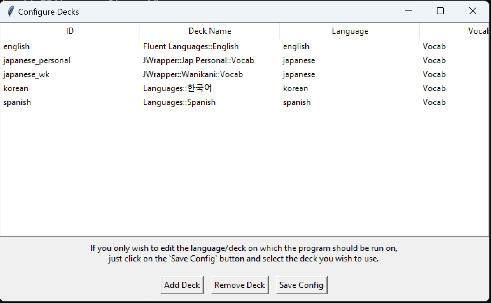
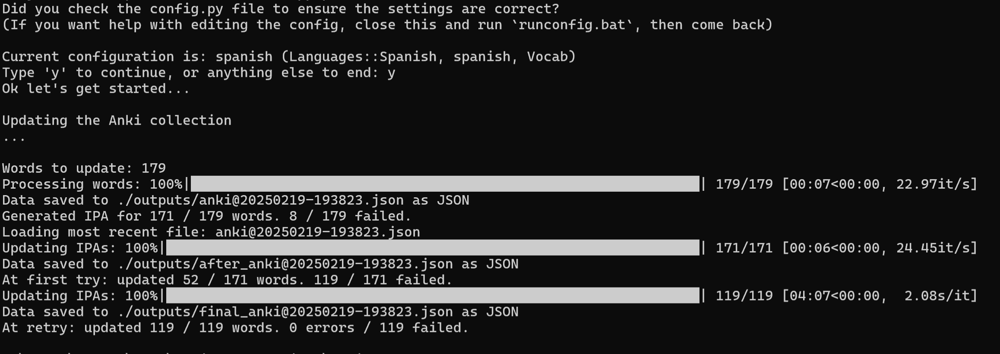

# What's this?
This is a simple python program to update your Anki cards with IPA pronunciation data.  
As of now, the only source I use is en.wiktionary.org.  

The program should work with any language but may have language specific issues as I only tested it on the ones I needed it for. Based on wiktionary's IPA content, success rate may go down (e.g. for english words like bearish have no IPA, for japanese 死神 doesn't either as it's a less common spelling).  

I used the program for Korean, Spanish, English, and Japanese, with success rates ranging from ~70% to ~90% based on language. In the future I will implement uninflection to push it to 100%, and maybe make it an extension instead of a standalone script.

# How To Use

### Setup Your Cards and Config
You need to have an empty field called `IPA`. If it's not empty, the word will be skipped.
You also need an `Extra-IPA` field, which stores whether the word has more etymologies which may have different pronunciations.

If you edited the port for AnkiConnect, you should also edit `ANKI_CONNECT_URL` accordingly (inside `config.py`).  

Setup the config file based on the name of your deck and the field in which the word is found. 
How do you set it up? Either: 
- Edit `config.py` manually (you just need to edit the `DECKS` dictionary)
- Activate the venv and run `python ./main.py --config`
- (Win Only) Double-click on `run.bat` and select the `config` option.

NOTE: If by chance you have too many failures when the program states `At first try` try and decrease the `N_JOBS_UPDATE` multiplier in config.py.

### Install Python Env and Run (Windows)
Note: don't run before checking [config.py](#configpy) is correct, also, do a backup of your collection before (although the program shouldn't be able to break it).

1) Download or clone this repository (for downloading, click the green button with `code` and download as zip) 

2) Install a working python with poetry if not available yet (I used 3.13.2 when developing, but other versions should work too)
    1) Download `python` from Download Python from [python.org/downloads](https://www.python.org/downloads/)
    2) Install `poetry` by running `pip install poetry` on PowerShell (just search for `PowerShell` in start)
        **NOTE:** If you have issues where pip or python isn’t found, check your PATH. If you need help, ask chatgpt or open an issue on this repo.
    3) Open a terminal in the repository directory (Anki-add-IPA)
    4) Now install the dependencies and activate the venv
        ```
        poetry config virtualenvs.in-project true
        poetry install
        ./.venv/Scripts/activate.ps1
        ```

3) Install the ankiconnect extension for python (https://ankiweb.net/shared/info/2055492159) if you don't have it yet.
    NOTE: my Anki installation as of dev time is Version 24.06.3 Python 3.9.18 Qt 6.6.2 PyQt 6.6.1, and AnkiConnect idk.

4) Run the application by double clicking `run.bat` and select the `run app` option (if your venv isn't in the current folder either move it there or modify the ps1 files accordingly)

5) You're done.  
   If, after running the application, you see an error ratio that is too high, check some of the words that failed in the output file 
   (named like `anki@YYYYDDMM-HHMMSS.json`). Search for those words manually on en.wiktionary.org.  
   - If the word isn’t there, it’s normal for the program not to work on that word.  
   - If it is there, try running the application again, as you may have encountered temporary timeout errors.


### Install Python Env and Run (Mac)
Note: The Mac guide is just slighly adjusted from the Windows guide using chatgpt o3-mini, as I don't have a Mac device to test with.
Note: don't run before checking [config.py](#configpy) is correct, also, do a backup of your collection before (although the program shouldn't be able to break it).

1) Download or clone this repository  
   (for downloading, click the green "Code" button and choose "Download ZIP").

2) Install a working Python with Poetry if you haven’t yet.  
   (I used Python 3.13.2 when developing, but other versions should work too)
   1) Download Python from [python.org/downloads](https://www.python.org/downloads/).  
   2) Install Poetry by running:  
      ```bash
      pip install poetry
      ```  
      **NOTE:** If you have issues where pip or python isn’t found, check your PATH. If you need help, ask chatgpt or open an issue on this repo.
   3) Open Terminal and navigate to the repository directory.
   4) Now install the dependencies and activate the venv
        ```
        poetry config virtualenvs.in-project true
        poetry install
        source .venv/bin/activate
        ```

3) Install the AnkiConnect extension for Anki, if you haven't yet.  
   Download it from: [https://ankiweb.net/shared/info/2055492159](https://ankiweb.net/shared/info/2055492159)

   **NOTE:**  
   My Anki installation (Windows -- at time of development) is Version 24.06.3, Python 3.9.18, Qt 6.6.2, and PyQt 6.6.1, with AnkiConnect version unknown.

4) Run the application:
   1) If you closed Terminal, open it again in the repository folder and activate the venv:
      ```bash
      source .venv/bin/activate
      ```
   2) Run:
      ```bash
      python ./main.py --app
      ```

5) You’re done.  
   If, after running the application, you see an error ratio that is too high, check some of the words that failed in the output file 
   (named something like `anki@xxx.json`). Search for those words manually on en.wiktionary.org.  
   - If the word isn’t there, it’s normal for the program not to work on that word.  
   - If it is there, try running the application again, as you may have encountered temporary timeout errors.

# Screenshots

## Configuration



## Running In Terminal
